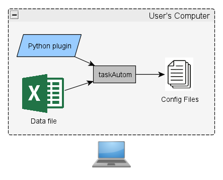
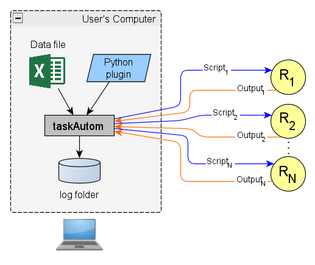
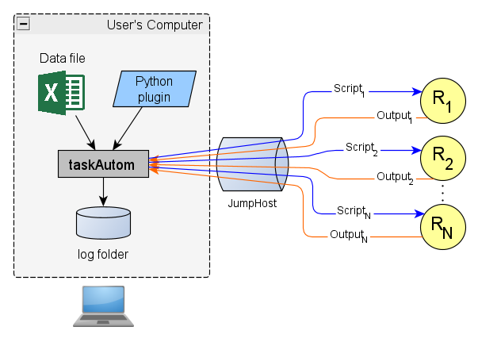
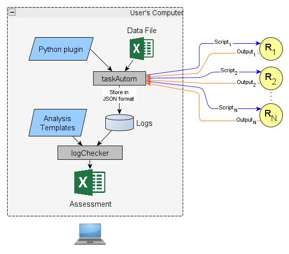
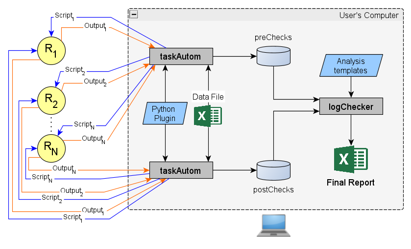

[](https://img.shields.io/pypi/pyversions/taskautom)
[](https://pypi.python.org/pypi/taskautom)
[](https://github.com/laimaretto/taskautom/blob/main/LICENSE)

# taskAutom #

This idea was born because of a need for a simple tool to automate the execution of simple configuration templates on Nokia SROS based routers. The data is provided in a data file (`.csv` or `.xlsx`), and the configuration templates are  written in pure Python. Configuration scripts are the result of these templates being rendered with the provided data.

## Table of Contents
- [Setup](#setup)
  - [System Libraries](#system-libraries)
  - [Installation](#installation)
  - [Upgrade](#upgrade)
- [Usage](#usage)
  - [Configuration Options, Parameters](#configuration-options-parameters)
  - [Bulk Script Execution on routers](#bulk-script-execution-on-routers)
    - [Data File](#data-file)
    - [Python Plugin](#python-plugin)
    - [Execute without connection to routers (`-j 0` / `-jobType 0`)](#execute-without-connection-to-routers--j-0----jobtype-0)
    - [Execute by connecting to the routers (`-j 2` / `-jobType 2`)](#execute-by-connecting-to-the-routers--j-2----jobtype-2)
      - [Using jumpHosts - `servers.yml`](#using-jumphost---serversyml)
      - [Inventory](#inventory)
  - [Bulk SCP/SFTP transfer to routers](#bulk-scpsftp-transfer-to-routers)
- [Use Cases of taskAutom with logChecker](#use-cases-of-taskautom-with-logchecker)

## Setup ##

### System Libraries
These libraries have been tested under Ubuntu 20.04 and 22.04, Windows10, Python 3.8~3.10.

### Installation

Make sure that you have [Python](https://www.python.org/downloads/) and [PIP](https://pip.pypa.io/en/stable/installing/) installed.

> [!IMPORTANT] 
> For Windows users, select "Add Python to PATH" during the installation.


For Ubuntu Users:
```bash
pip3 install taskAutom
```
For Windows users:
```bash
py -m pip install taskAutom
```

The source code is hosted on GitHub at https://github.com/laimaretto/taskautom

Installer for the latest released version available at [Python Package Index (PyPI) - taskAutom](https://pypi.org/project/taskautom)


### Upgrade 
If taskAutom is already installed, it's possible to verify the version with:
```bash
taskAutom -v
```
To upgrade to the latest version, the following commands can be used.
#### Ubuntu
```bash
pip3 install taskAutom --upgrade
```
#### Windows
```bash
pip install taskAutom --upgrade
```

[Go to Table of Contents](#table-of-contents)

## Usage

### Configuration Options, Parameters

taskAutom can be configured through CLI as shown below. It is also possible to run `taskAutom -h` directly to show this information.

#### Optional arguments

| Parameter | Description |
| ----------| ----------- |
| `-h` | Show all parameters and exit. |
| `-v` / `--version` | Show version |


#### JobTypes:
| Parameter | Description |
| ----------| ----------- |
| `-j` / `--jobType` |  Type of job. `-j=0` [to check data and plugin](#execute-without-connection-to-routers--j-0-----jobtype-0); `-j=2`, [to execute](#execute-by-connecting-to-the-routers--j-2-----jobtype-2). `-j=3`, [to upload files via SCP/SFTP](#bulk-scpsftp-transfer-to-routers). When `-j=3`, password must be entered manually. **Choices: 0, 2, 3. Default=0** |

#### Plugin arguments:
| Parameter | Description |
| ----------| ----------- |
| `-pt` / `--pluginType` | Type of plugin. **Choices: `show` or `config`. Default=show** |
| `-py` / `--pluginFilename` | Python Template File. Optional if jobType=3 |

More information in [python plugin section](#python-plugin).

#### Data Related:
| Parameter | Description |
| ----------| ----------- |
| `-d` / `--dataFile` | Data file with parameters. Either `.csv` or `.xlsx`. If `.xlsx`, enable the `-xls` option with sheet name.|
| `-log` / `--logInfo` | Name of the log folder. Logs, MOP and scripts will be stored here. |
| `-lt` / `--logTime` | Create the log folder with a timestamp in its name.  **Choices: yes, no. Default=yes** |
| `-fn` / `--logFileName` | Name of the log fileName. **Choices: ip, hostname. Default=hostname** |
| `-uh` / `--useHeader` | When reading data, consider first row as header. **Choices: yes, no. Default=yes** |
| `-gc` / `--dataGroupColumn` | Only valid if using headers. Name of column, in the data file, to filter routers by. In general one should use the field where the IP of the router is. **Default=ip**  |
| `-xls` / `--xlsSheetName` | Excel sheet name, when using `-d xlsx` |
| `-so` / `--strictOrder` |  Follow strict order of routers inside the data file, row by row. If enabled, threads=1. **Choices: yes, no. Default=no** |
| `-hoe` / `--haltOnError` | If using `-so yes`, halts if error found on execution. **Choices: yes, no. Default=no** |
| `-pbr` / `--passByRow` | Pass data to the plugin by row (and filtered by `-gc`). Only valid with `-so no`. **Choices: yes, no. Default=yes** |

More information in [data file section](#data-file).

#### Credentials:
| Parameter | Description |
| ----------| ----------- |
| `-u` / `--username`| Username to connect to routers. |
| `-pf` / `--passwordFile`| Filename containing the default password to access the routers. If the file contains several lines of text, only the first line will be considered as the password. **Default=None** |

#### Connection:
| Parameter | Description |
| --------- | ----------- |
| `-th` / `--threads` | Number of threads. **Default=1** |
| `-tun` / `--sshTunnel` |  [Use SSH Tunnel to routers.](#using-jumphost---serversyml) **Choices: no, yes. Default=yes** |
| `-jh` / `--jumpHostsFile` | [JumpHosts file.](#using-jumphost---serversyml) **Default=`servers.yml`** |
| `-dt` / `--deviceType` | Device Type. **Choices: nokia_sros, nokia_sros_telnet, nokia_srl. Default=nokia_sros** |
| `-cv` / `--cmdVerify` | Enable `--cmdVerify` when interacting with router. Disable only if connection problems. **Choices: yes, no. Default=yes** |
| `-rto` / `--readTimeOut` | Read Timeout. Time in seconds which to wait for data from router. **Default=10** |
| `-tbr` / `--timeBetweenRouters` | Time to wait between routers, in miliseconds (ms), before sending scripts to the router. **Default=0** |
| `-axr` / `--auxRetry`| Times to try obtaining aux values before "not-match". **Default=10** |


#### Misc:
| Parameter | Description |
| --------- | ----------- |
| `-inv` / `--inventoryFile` | [Inventory file](#inventory) with per router connection parameters. **Default=None** |
| `-gm` / `--genMop` | [Generate MOP document](#mop-method-of-procedure) in `.docx` format. **Choices: yes, no. Default=no** |
| `-crt` / `--cronTime` | Data for CRON: type(ie: oneshot or periodic), name(ie: test). If type=oneshot, need to define: month(ie april), weekday(ie monday), day-of-month(ie 28), hour(ie 17), minute(ie 45). If type=periodic, need to define: interval in seconds (ie 35). |
| `-sd` / `--sshDebug`| Enables debuging of SSH interaction with the network. Stored on debug.log. **Choices: yes, no. Default=no** |

[Go to Table of Contents](#table-of-contents)

## Bulk Script Execution on Routers ##

The program needs two mandatory inputs: 
 1) [Data file](#data-file) (`.csv` or Excel file, `.xlsx`);
 2) A [Python plugin](#python-plugin), which is nothing but a configuration template.

### Data file

The data can be either a `.csv` or `.xlsx` file. There must be a column named `ip` with the IP addresses of the routers that `taskAutom` will connect to. The name of this column can be changed using the configuration option `-gc myColName`.

The `ip` column (or eventually changed by `-gc`) allows `taskAutom` to group routers based on that column when processing the data. This is particularly useful if the same router appears in multiple rows of the the data file.

If you want `taskAutom` not to group routers by the `ip` column, you should use the `-so yes` CLI parameter. This will process the routers' data in the exact order it appears in the data file.

The remaining columns in the data file are the treated as variables to be used in the configuration template.

**Example:** Below is a `.csv` for two different routers, including the data to modify their interfaces.

```csv
ip,name,port,interName,ipAddress
10.0.0.1,router1,1/1/1,inter1,192.168.0.1/30
10.0.0.2,router2,1/3/5,inter7,192.168.2.1/30
```

> **Notes on the Data File:**
> 
> There are cases where it is necessary to send the complete `dataFrame` to the plugin. In those cases, the CLI parameter `-pbr no` should be used. When doing so, taskAutom will send the entire set of rows selected by the IP of the router, to the plugin. By default, the `-pbr` parameter is set to `yes`.

### Python Plugin

The plugin is a Python code which is fed with each row of the data file at a time, in order to render a configuration script. It consists of a function called `construir_cliLine()` which accepts four arguments:
- `m` which is a counter, representing the `row_id` of the data.
- `datos` which is a `Pandas` object; the data itself.
- `lenData` which is the length of the Pandas dataFrame; i.e.: the amount of rows inside the grouped data.
- `mop`, a boolean.

`m` and `lenData` can be used to decide when some part of the code must be ran. `mop` is used when the configuration script needs to be verified before running; `mop=True` when the CLI parameter `-j` is `0`.

**Example:** using the previous data, to generate configuration scripts. The example is assuming no header has been defined in the data file (`-uh no`), so column `ip` is used to identify the proper variable.

```python
def construir_cliLine(m, datos, lenData, mop=None):

    ipSystem   = datos.ip
    router     = datos.name
    port       = datos.port
    intName    = datos.interName
    address    = datos.ipAddress

    cfg        = ""

    if mop and m == 0:
        cfg = "\nHeading_2:Router: " + router + ", " + ipSystem + "\n"

    cfg = cfg + f'/configure router interface {intName} port {port}\n'
    cfg = cfg + f'/configure router interface {intName} address {address}\n'

    if m == lenData-1:
        cfg = cfg + f'/configure router interface {intName} no shutdown\n'

    return cfg
```

> **Notes on Plugin:**
> 1) When writing plugins, **do not** to use abbreviated commands. This could potentially lead to errors. For example: `/configure rout int system add 10.0.0.1/32` is discouraged. It is better to use `/configure router interface system address 10.0.0.1/32`.
> 2) Common practice: it is better to try to accommodate plugins so that they reflect they purpose. Then, use the configuration parameter `--pluginType=[show|config]` to match the intended purpose of the plugin.
> 3) Only disable `cmdVerify` (`-cv no`) if experiencing issues.

#### MOP: Method of Procedure

To create MOP, it is necessary to use `-gm yes` when running `taskAutom`.

When writing a plugin, is important to help `taskAutom` understand which string should be considered as a title if you intend to generate a Word document (`.docx`) from the combination of the data file and the plugin. 

This can be done by adding the prefix `Heading_2` to the `title` variable under the `if mop:` statement. After this, a MOP is created with the intended information. There is also the possibility to use the prefix `Heading_3`.

### Execute without connection to routers (`-j 0 ` / `--jobType 0`):

**An example invoking `taskAutom` with option `-j 0`**:

*If needed, [check the parameters](#configuration-options-parameters).*

```bash
$ taskAutom -d example/example.csv -py example/example.py -log test -j 0
```
||
|:--:| 
| *Running taskAutom with `-j 0`*|

Resulting in a folder with the name specified in `-log` parameter. Contents of created folder:

 - One file per router (`job0_<IP_router>.cfg`), with all commands generated by [Python plugin](#python-plugin) and [data file](#data-file). **Example:**
```
/configure router interface inter1 port 1/1/1
/configure router interface inter1 address 192.168.0.1
```
 - One file `job0_<plugin.py>.txt`, with the rendered output. **Example:**

```
Router: router1, 10.0.0.1
/configure router interface inter1 port 1/1/1
/configure router interface inter1 address 192.168.0.1

Router: router2, 10.0.0.2
/configure router interface inter7 port 1/3/5
/configure router interface inter7 address 192.168.2.1
```

### Execute by connecting to the routers (`-j 2 ` / `--jobType 2`):

When `taskAutom` is invoked with option `-j/--jobType 2`, it will connect to each and every router, and execute the commands. User and password must be provided in this case.

> [!TIP]
> To verify the commands to be applied before running them on the networks elements, it is recommended to run `-j 0` first.

As will be discussed in the [following section](#using-jumphost---serversyml), jumpHosts can be used if necessary. 

**Example invoking `taskAutom` with option `-j 2`:**
*If needed, [check the parameters](#configuration-options-parameters).*

```
taskautom -py example/example.py -d example/example.csv -pt config -j 2 -u admin -log test
```

||
|:--:| 
| *Running taskAutom with `-j 2`*|

 Resulting in:
 - Command execution on the routers;
 - Saving the logs in a folder named after `-log` parameter and execution start time. The contents of the created log folder are as follows:
   - `00_log_console.txt`: Information displayed on the console during execution;
   - `00_log.csv`: Execution summary for each router, including details such as success status, execution time, number of lines sent and received, the server connected to, and more;
   - `00_report.json`: Execution report in `.json`, containing details about what was executed;
   - `00_report.txt`: Summary of execution information, also displayed on the console;
   - `<RouterName>_commands.cfg`: Commands sent to a specific router, according to the [Python plugin](#python-plugin) and [data file](#data-file);
   - `<RouterName>_rx.json`: Generated when taskAutom is executed with `-pt show`. It displays the commands and their outputs, organized in `.json` format;
   - `<RouterName>_rx.txt`: Outputs of the executed commands, in plain text format.

#### Using jumpHost - `servers.yml`

When using a jumpHost, `taskAutom` will create a standard ssh-based tunnel (ie: TCP-port-forwarding) to the far-end, which is the router.

||
|:--:| 
| *Example using one jumpHost*|

The file `servers.yml` has configuration parameters for the Jump Host(s). Add as many as needed. If more than one jump host is declared, the connections will be load balanced sequentially among them. You can comment out some servers, if needed.

```yml
srvr0:
    name: 'myServer'
    user: 'myUser'
    password: 'myPass'
    ip: '1.1.1.1'
    port: 22
srvr1:
    name: 'myServer'
    user: 'myUser'
    password: 'myPass'
    ip: '2.2.2.2'
    port: 22    
```

#### Inventory

By default, `taskAutom` connects to each and every router that exists inside the data file (identifying the routers by the `ip` column). Optionally, an inventory file can be provided, with per router connection parameters. If so, the default connection values are overridden by those inside the inventory file.

ip|username|password|useSSHTunnel|readTimeOut|deviceType|jumpHost|
--|--------|--------|------------|----------|--------|---------
10.0.0.1|user1|pass1|yes|15|nokia_sros|server1|1000
10.0.0.2|user2|pass2|no|90|nokia_sros_telnet|
10.0.0.3|user3|pass3|no|90|nokia_srl|

If fieds in the `inventory.csv` file are left empty, default values are used.

## Bulk SCP/SFTP transfer to routers ##

There is also the possibility of bulk transfer of files to several routers. To do so, you need to do the following:

- Prepare a dataFile with the following three column names: `ip|ftpLocalFilename|ftpRemoteFilename`.
- Use `-j 3`;

Next, `taskAutom` will connect to each and every router, transfering the `ftpLocalFilename` and creating on the remote device a file with the name `ftpRemoteFilename`.

[Go to Table of Contents](#table-of-contents)

## Use Cases of taskAutom with logChecker

[`LogChecker`](https://github.com/laimaretto/logchecker/) reads the logs stored in folders. These logs are generally obtained by `taskAutom`. Though not mandatory, `taskAutom` is suggested as a way of obtaining the logs, because these will be stored in a `.json` file automatically.

`LogChecker` organizes the outputs from several show commands on different tabs in an Excel file, helping the verification of information. The data parsing is performed using templates.

There are two ways of execution: assessment or pre-post check comparison. More information can be obtained through the [logchecker's github page](#https://github.com/laimaretto/logchecker/).

### Examples:

||
|:--:| 
| *Use case: taskAutom and logChecker to make an assessment*|

||
|:--:| 
| *Use case: taskAutom and logChecker to pre-post check comparision*|


[Go to Table of Contents](#table-of-contents)